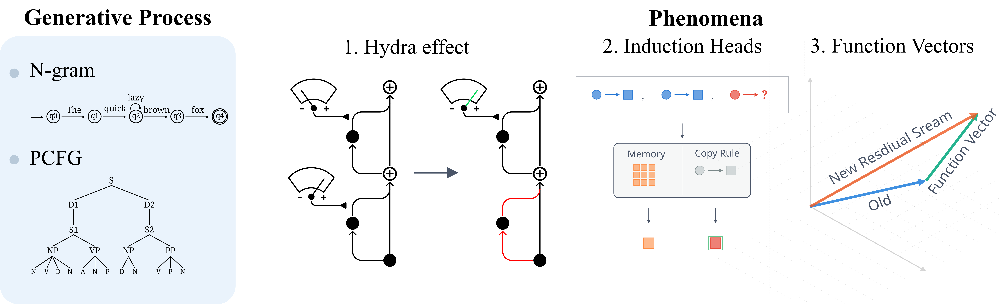

[](https://put-here-your-paper.com)
[](https://github.com/UKPLab/arxiv2026-hierarchical-latent-structures/blob/main/LICENSE)
[](https://www.python.org/)

Hierarchical Latent Structures in Data Generation Process Unify Mechanistic Phenomena across Scale
------

> **Abstract:** Contemporary studies have uncovered many puzzling phenomena in the neural information processing of Transformer-based language models. Building a robust, unified understanding of these phenomena requires disassembling a model within the scope of its training. While the intractable scale of pretraining corpora limits a bottom-up investigation in this direction, simplistic assumptions of the data generation process limit the expressivity and fail to explain complex patterns. In this work, we use probabilistic context-free grammars (PCFGs) to generate synthetic corpora that are faithful and computationally efficient proxies for web-scale text corpora. We investigate the emergence of three mechanistic phenomena: induction heads, function vectors, and the Hydra effect, under our designed data generation process, as well as in the checkpoints of real-world language models. Our findings suggest that hierarchical structures in the data generation process serve as the X-factor in explaining the emergence of these phenomena. We provide the theoretical underpinnings of the role played by hierarchy in the training dynamics of language models. In a nutshell, our work is the first of its kind to provide a unified explanation behind the emergence of seemingly unrelated mechanistic phenomena in LLMs, augmented with efficient synthetic tooling for future interpretability research.

<p align="center">
  
</p>


[UKP Lab](https://www.ukp.tu-darmstadt.de/) | [TU Darmstadt](https://www.tu-darmstadt.de/
)


## Prerequisites

This project uses [uv](https://github.com/astral-sh/uv) as the Python package manager. Install dependencies and setup the virtual environment:

```bash
uv sync
```
## Run N-gram pipeline 
```bash
uv run experiment --config-path=configs/ngram.yml
```
## Run PCFG pipeline
```bash
uv run experiment --config-path=configs/pcfg.yml
```
## Run OLMo-1b evaluation

To reproduce all OLMo evaluation results run:

### Step 1: Download prerequisites
```bash
WANDB_API_KEY=your_api_key uv run python olmo_evaluation/prerequisites/download_wandb_log.py
uv run python olmo_evaluation/prerequisites/download_checkpoints.py
uv run python olmo_evaluation/prerequisites/download_paloma.py
```

### Step 2: Run evaluation
```bash
uv run olmo_evaluation/multi_gpu_entry.py 
```
## Cite

If you found our data or code helpful, please cite our paper:

```
@InProceedings{smith:20xx:CONFERENCE_TITLE,
  author    = {Smith, John},
  title     = {My Paper Title},
  booktitle = {Proceedings of the 20XX Conference on XXXX},
  month     = mmm,
  year      = {20xx},
  address   = {Gotham City, USA},
  publisher = {Association for XXX},
  pages     = {XXXX--XXXX},
  url       = {http://xxxx.xxx}
}
```

## Disclaimer

> This repository contains experimental software and is published for the sole purpose of giving additional background details on the respective publication. 


## File structure
```
├── .gitignore
├── LICENSE
├── README.md
├── analysis
│   ├── data_loader.py
│   ├── function_vectors.ipynb
│   ├── hydra_effect.py
│   ├── induction_heads.ipynb
│   ├── plot_helpers.py
│   ├── plot_hydra_effect.ipynb
│   ├── structure_analysis.ipynb
│   └── training_losses.ipynb
├── configs
│   ├── ngram.yml
│   └── pcfg.yml
├── corpus_generator
│   ├── Cargo.lock
│   ├── Cargo.toml
│   ├── clippy.toml
│   ├── src
│   │   ├── arrow_writer.rs
│   │   ├── config
│   │   │   ├── mod.rs
│   │   │   └── ngram.rs
│   │   ├── language
│   │   │   ├── mod.rs
│   │   │   ├── ngram.rs
│   │   │   └── pcfg.rs
│   │   ├── lib.rs
│   │   ├── main.rs
│   │   └── tokenizer.rs
│   └── tests
│       ├── bigram_validation_test.rs
│       └── test_languages.rs
├── experimental_setup.png
├── olmo_evaluation
│   ├── evaluators
│   │   ├── hydra_effect.py
│   │   └── induction_heads.py
│   ├── multi_gpu_entry.py
│   └── prerequisites
│       ├── download_checkpoints.py
│       ├── download_paloma.py
│       └── download_wandb_log.py
├── pyproject.toml
├── training_pipeline
│   ├── configs
│   │   ├── __init__.py
│   │   ├── experiment_config.py
│   │   ├── model_config.py
│   │   └── runner_config.py
│   ├── entry.py
│   ├── runner.py
│   └── utils
│       ├── __init__.py
│       ├── aim_gpu_filter.py
│       ├── arrow_loader.py
│       ├── checkpoint_manager.py
│       ├── duration.py
│       ├── evaluator_factory.py
│       ├── logger.py
│       ├── model_factory.py
│       ├── model_utils.py
│       ├── trainer_factory.py
│       └── training_loss_logger.py
└── uv.lock
```

